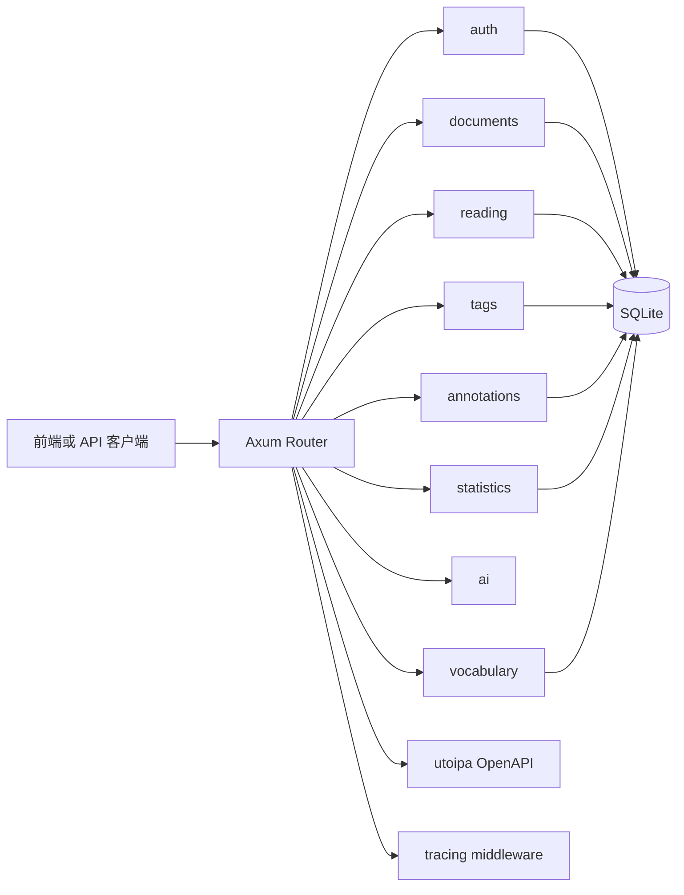
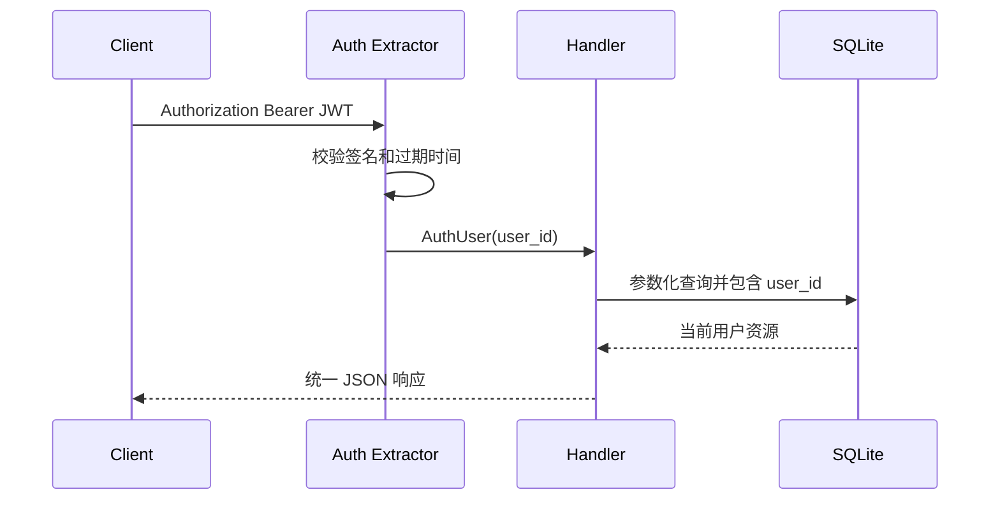

# 后端架构设计

| 项目 | 内容 |
|---|---|
| 文档名称 | 后端架构设计 |
| 项目名称 | IntelliRead |
| 负责人 | 成员 B |
| 状态 | Implemented |
| 最后更新 | 2026-06-29 |

## 架构

采用模块化单体，HTTP、业务校验和数据访问按业务模块组织，避免在 MVP 阶段引入微服务与队列。

## 模块边界

| 模块 | 职责 | 所有者 |
|---|---|---|
| `config` | 环境变量与安全默认值 | 成员 B |
| `database` | 连接池、目录创建、migration | 成员 B |
| `auth` | 注册、登录、Argon2、JWT extractor | 成员 B |
| `documents` | 上传限制、段落解析、文档查询与归属校验 | 成员 B |
| `reading` | 阅读位置与百分比 upsert | 成员 B |
| `tags` | 用户标签与文档标签关联 | 成员 B |
| `annotations` | 文档/段落笔记和文本高亮 | 成员 B |
| `statistics` | 当前用户学习数据聚合 | 成员 B |
| `ai` | 划词与整篇分析、可切换 provider | 成员 C 提供业务契约，成员 B 后端适配 |
| `vocabulary` | 词汇卡 CRUD、到期队列与复习调度 | 成员 E 提供业务契约，成员 B 后端适配 |
| `response` / `error` | 统一成功与错误结构 | 成员 B |

AI、词汇与复习模块已按确认的业务契约落地第一版后端接口。AI 模块保持无状态，词汇与复习数据由 `0003_vocabulary_review.sql` 持久化并按 `user_id` 隔离。详见 [AI 模块设计](AI_MODULE_DESIGN.md) 和 [词汇与复习 API](../api/VOCABULARY_REVIEW_API.md)。

## 请求流程

