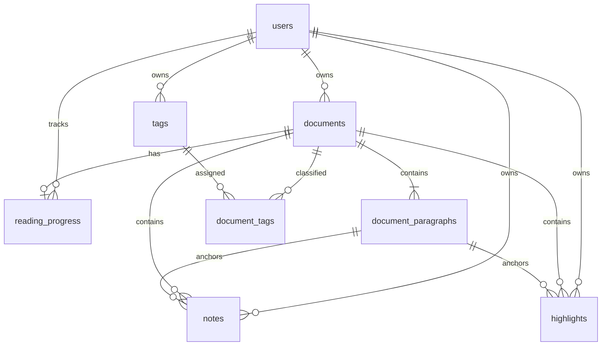

# 数据库设计

| 项目 | 内容 |
|---|---|
| 文档名称 | 数据库设计 |
| 项目名称 | IntelliRead |
| 负责人 | 成员 B |
| 状态 | Implemented |
| 最后更新 | 2026-06-12 |

实现来源为 `backend/migrations/0001_core.sql` 和 `0002_document_features.sql`，详细字段表见 [DATA_MODEL](../project-memory/DATA_MODEL.md)。

删除用户时级联删除其文档、标签、进度和标注；删除文档时级联删除段落、标签关联、进度、笔记和高亮。所有外键在连接创建时启用，常用列表与关联字段均有索引。

时间统一存储为 RFC 3339 `TEXT`。标识符使用 UUID 文本，避免暴露递增业务规模并便于未来离线合并。
