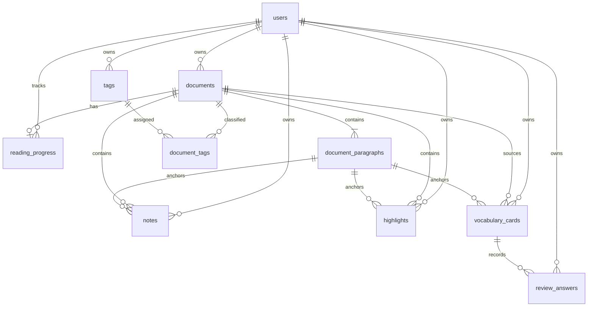

# 数据库设计

| 项目 | 内容 |
|---|---|
| 文档名称 | 数据库设计 |
| 项目名称 | IntelliRead |
| 负责人 | 成员 B |
| 状态 | Implemented |
| 最后更新 | 2026-06-29 |

实现来源为 `backend/migrations/0001_core.sql`、`0002_document_features.sql` 和 `0003_vocabulary_review.sql`。详细字段与约束以 migration 为准，词汇与复习字段说明见 [词汇与复习 API](../api/VOCABULARY_REVIEW_API.md)。

删除用户时级联删除其文档、标签、进度和标注；删除文档时级联删除段落、标签关联、进度、笔记和高亮。所有外键在连接创建时启用，常用列表与关联字段均有索引。

时间统一存储为 RFC 3339 `TEXT`。标识符使用 UUID 文本，避免暴露递增业务规模并便于未来离线合并。
## 词汇与复习表

Migration `backend/migrations/0003_vocabulary_review.sql` 新增两张用户私有表：

- `vocabulary_cards`：保存来源文献、可选段落、术语、发音、释义、例句、原文上下文、掌握状态和下次复习时间。
- `review_answers`：保存每次复习答题结果、答题时间和计算出的下次复习时间。

两张表都包含 `user_id`，所有查询、更新、删除和复习操作都必须按当前用户隔离。`vocabulary_cards` 使用 `user_id + document_id + term` 唯一约束避免同一用户在同一文献下重复添加同一术语。
